# The Anglers Angle
A social/blog site for Anglers to show of their best catch, join groups and enter competitions

The Objective of this site is to grow the angling community through social interaction

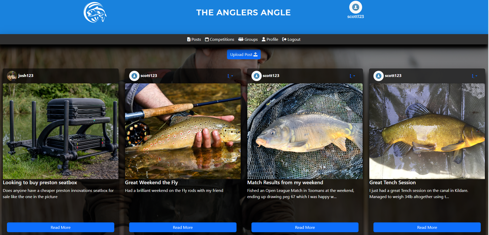

The Deployed Site is available [HERE](https://the-anglers-angle-b8d0becc6882.herokuapp.com/)

## Table of Contents
+ [UX](#ux "UX")
  + [Site Goal](#site-goal "Site Goal")
  + [Audience](#audience "Audience")
  + [Current User Goals](#current-user-goals "Current User Goals")
  + [New User Goals](#new-user-goals "New User Goals")
  + [Agile Planning](#agile-planning "Agile Planning")
+ [Design](#design "Design")
  + [Logo](#logo "Logo")
  + [Colour](#colour "Colour")
  + [Typography](#typography "Typography")
  + [Layout](#layout "Layout")
  + [WireFrames](#wireframe "WireFrames")
+ [Features](#features "Features")
  + [Current Features](#current-features "Current Features")
  + [Future Features](#future-features "Future Features")
+ [Testing](#testing "Testing")
  + [HTML Validation](#html-validation "HTML Validation")
  + [CSS Validation](#css-validation "CSS Validation")
  + [PEP8 Validation](#pep8-validation "PEP Validation")
  + [Unit Tests](#unit-tests "Unit Tests")
  + [Manual Tests](#manual-tests "Manual Tests")
  + [Unfixed Bugs](#unfixed-bugs "Unfixed Bugs")
  + [Encountered Bugs](#encountered-bugs "Encountered Bugs")
+ [Technologies Used](#technologies-used "Technologies Used")
  + [Languages Used](#languages-used "Languages Used")
  + [External Programs and Libraries Used](#external-programs-and-libraries-used "External Programs and Libraries Used")
+ [Deployment](#deployment "Deployment")
+ [Credit](#credit "Credit")
  + [Media](#media "Media")
  + [Code](#code "Code")
  
  
  
## UX
### Site Goal:
- Allow users to socially interact through posts and comments easily without distraction.

### Audience:
This Site was mainly developed to attract an audience with an interest in Angling

### Current User Goals:
- Register for Competitions around their local area
- Post in groups to show of their latest catch

### New User Goals:
- Gain more knowledge in different areas in angling
- Meet Fellow anglers to go fishing with

### Agile Planning
- Below is the kanban board below with the user stories i often went back through during the project to keep the development in line with the project goals
  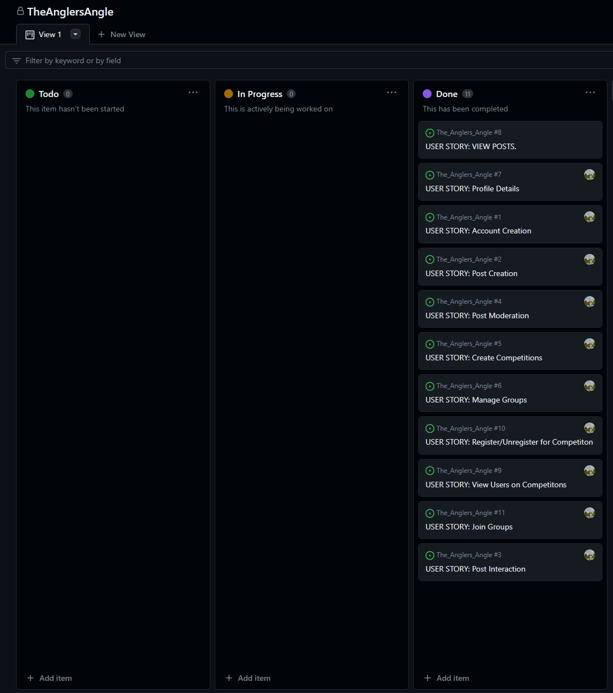

## Design

### Logo:

I wanted to create a recognisable logo for the site that would indicate to the user what the site is about but also provide a nice representation of the brand.

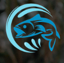
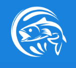

### Colour:

The aim of the colour scheme was to provide a calming user experience to the site. This is achieved through the implementation of gradients and blue shades.

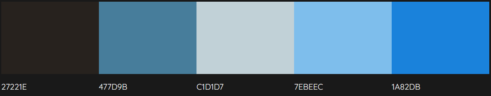

### Typography

The main typography used throughout the site was `Montserrat`.This was chosen to provide clear information to the user but also provide a nice aesthetic The font works well in all weights and looks professional throughout.

### Layout

The  goal of the layout for this site was to provide easy navigation and to distuingish between the sites elements with ease. This is achieved through the use of bootstrap layout and bootstrap cards. 

The Wireframes for the site layout can be viewed below

## Features 

### Current Features 

#### Post

This is the home page for the user after a successful login, Here the user can see all the public posts(outside of groups). If a user is the creator of one of these posts they have the option to edit or delete it in 2 clicks.

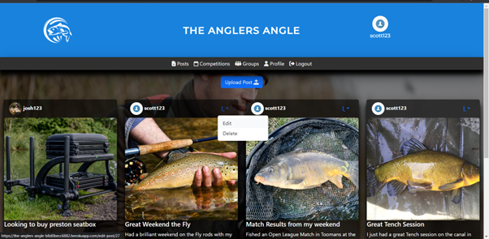

#### Detailed View of Posts

This is the detailed view of each individual post, again if the user is the author they can edit and delete from this screen. towards the bottom of this page the user can like and comment on the post. The author of each comment can edit and delete their own comment

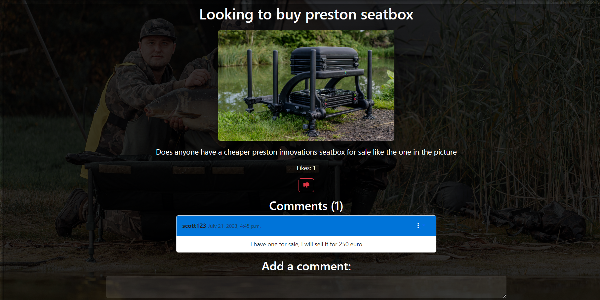

#### Competitions 

This feature is where users can view all of the current competitions that are published within the site. Users can create their own competition also to suit their needs for their angling club
In future versions of the app users will be able to register as a club so they can host their own comepetitions for members only.

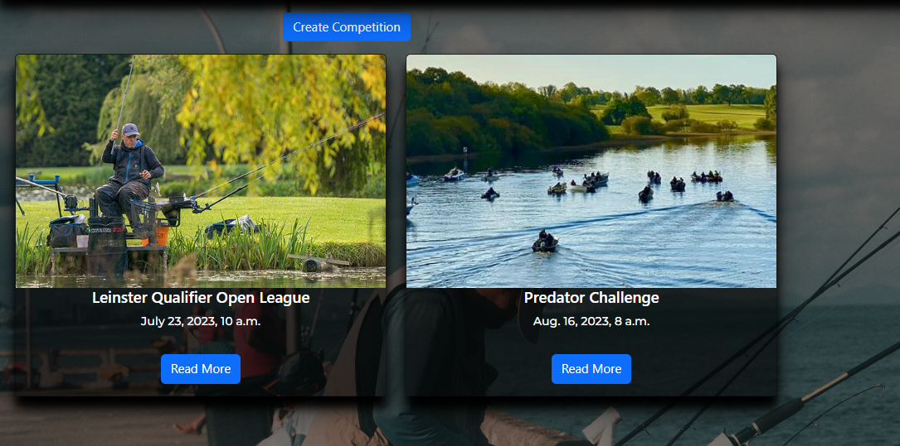

#### Competition home page

This is view of each individual competition. Here users can see all details relative to the competition and can also sign up and unregister for the competition. A list of all registered users is displayed for each competition.

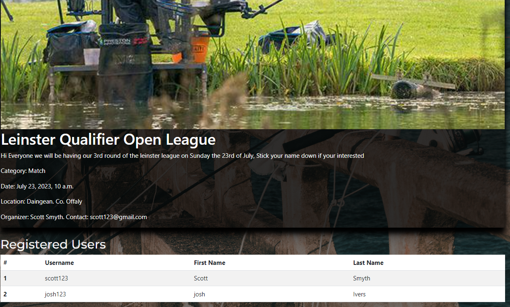

#### Groups

This feature is where users can find groups relative to their interest in a particular area of fishing. Users can request for a group to be created and wait for admin approval so other users can see it publicly.

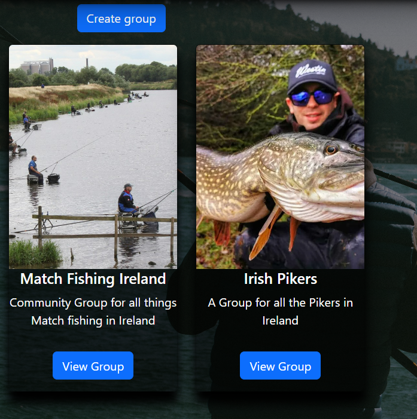

#### Groups home page

This is view of each individual group. Here users can see group posts but cannot post until they enter the group. A list of all group members is also displayed to the user. Each group post is only displayed in the group and not public.

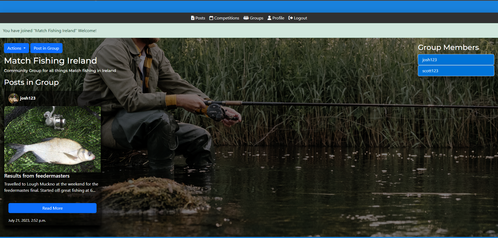

#### Profile

This feature displays the current users profile and each of the posts they have posted within the site. A user can update their profile details, add a profile picture and reset their password.

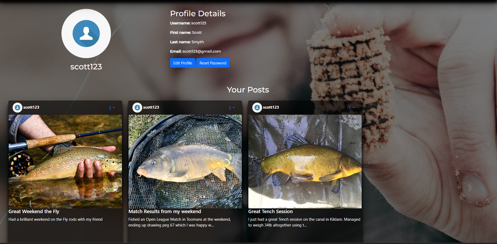

### Future Features

- Authenticated Forgot Password - this was an initial feature but due to Codeanywhere backend server Nginx timing out with sending requests the feature was discared due to time constraints
- Chat Feature
- Marketplace
- Integrate useful API's - Google Maps, Weather, Water Level
- Competition results

## Testing

### HTML Validation

After Validating the HTML code throughout and making final changes. The HTML code has no issues throughout.

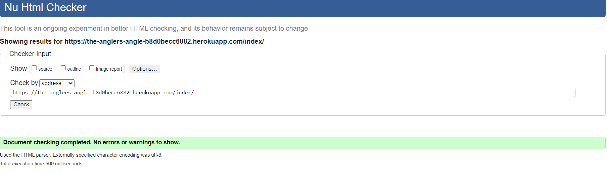

### CSS Validation

CSS passed validation with no errors.

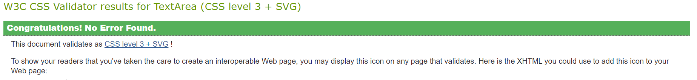

### PEP8 Validation

All Python scripts are in line wiht PEP8 style guide rules.

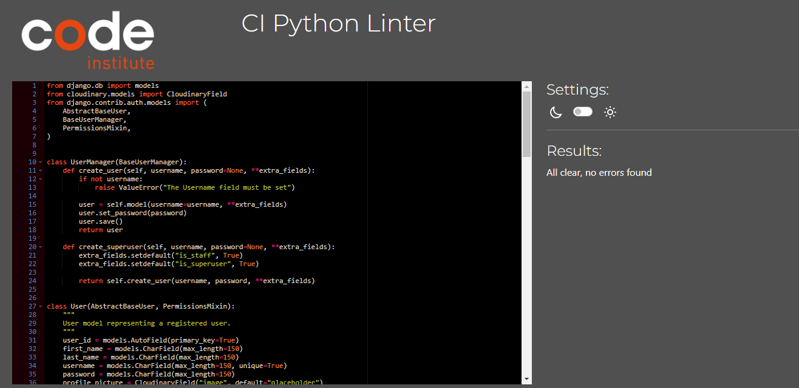

### Unit Tests

View logic was asserted through the use of Unit Tests and had an overall coverage of 93%.

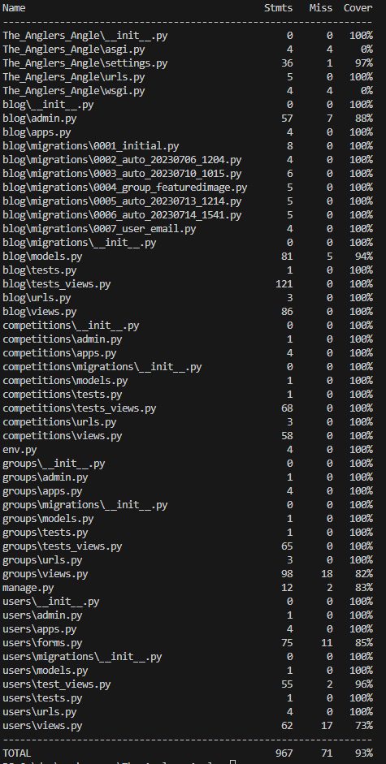

### Manual Tests

Manual Test results can be found [HERE](docs/testing.md)

### Unfixed Bugs
##### No Known Unfixed Bugs.

##### Encountered Bugs 

- Password reset - During the implementation of using Djangos Built in Password reset function. CodeAnywheres web server Nginx was taking to long to process the response from SMPT server
  a request timeout was thrown. As time was a limitation to fix this I implemented a simplified version to work. One solution to this would be to increase Nginx timeout period to allow for the response to come back.
  CodeAnywhere also went down during this period in development so that slowed down development. I later changed to code locally.

- Deploy Issues with Static Files -  The project is using cloudinary to serve my static files to the site. During some test deploys I encountered an 'etag' key error. This error is because the request is looking for an
etag in the response header but does not find it. The solution to this error was to clear my cloudinary directory of my static files and allow heroku to serve them again during build time by running collectstatic.

  
## Technologies Used

### Languages Used
- HTML5
- CSS3
- Python

### Python Modules Used
- Django Class based views (ListView, UpdateView, DeleteView, CreateView) 
- LoginRequired Mixin( used to enforce login authority on pages)
- messages ( used to display messages to users throughout the site)
- Authenticate - ( used to verify the provided username and password and return a User object if the credentials are valid.)
- External Modules can be found [HERE](requirements.txt)

### External Programs and Libraries Used
- Google Fonts - for the font family.
- Font Awesome - to add icons throughout the site.
- GitPod - to creat my html files & styling sheet before pushing the project to Github.
- GitHub - to store my repository for submission.
- Favicon - to provide the code & image for the icon in the tab bar.
- MockFlow Wireframe - to create Wireframes for the site layout.
- Cloudinary - used to host static and media files
- ElephantSQL - used to host postgres database used in project.

## Deployment
The Site was deployed using Heroku Hosting Platform. A really powerful platform at that.

### Deployment Steps
- Create a new project on Heroku
- Connect Github Repo
- In settings, configure Environment Variables lilke Database URL, Cloudinary URL etc..
- In Deploy, configure your automatic deploys or not.
- Deploy App

### Cloning for Further Development(Codeanywhere)
  - Open Codeanywhere.
  - Click on "File" in the top menu bar, then select "New Connection" > "From Git, GitHub, Bitbucket, Gitlab, URL".
  - In the pop-up dialog box, paste the repository URL you want to clone: https://github.com/scottsmyth56/The_Anglers_Angle and click "Next".
  - Give your new connection a name and click "Create".
  - Codeanywhere will create a new container with your cloned repository. It may take a few minutes.
  - Once it's done, click on the "Folder" icon on the left sidebar to find your cloned repository.
  - You can start working on the codebase, make changes and save them.
  - When you are ready to push your changes, right click on your container and select "SSH Terminal" to open the terminal.
  - In the terminal, navigate to your project folder (if you're not already there).
  - Run git add . to add all the changes.
  - Commit your changes by running git commit -m "your commit message".
  - Push your changes by running git push.

### Cloning for Further Development ( Locally )
 - Make sure you have Git installed on your computer. If you don't have it already, you can download it from the official website (https://git-scm.com/)
 - Open a terminal window (on Windows, Git Bash is a good option)
 - Navigate to the directory where you want to clone the repository using the cd command. For example, to navigate to the Documents folder, you would use the command cd Documents.
 - Use the following command to clone the repository: git clone https://github.com/scottsmyth56/The_Anglers_Angle
 - The command will create a new directory called "Software-Savvy-Quiz" in the current directory, and will copy all the files from the repository into that directory.
 - Navigate into the newly cloned directory by running cd Software-Savvy-Quiz.
 - you can check the content of the cloned repository by running ls command
 - Make sure to update your local copy with the remote repository by running git pull command
 - you can start to use the cloned repository as you wish

## Credit 

### Media

### Imagery

- Background images sourced from  https://www.pexels.com/.

 Icons sourced from:
- https://icons8.com/
- https://fontawesome.com/

### Code

- pythontutorial.net/django-tutorial/django-registration/	 - Referenced during the development of user registration
- https://docs.djangoproject.com/en/4.2/topics/auth/ - Referenced during development of authentication process
- https://docs.djangoproject.com/en/4.2/ref/contrib/messages/ - for message displays
- https://docs.djangoproject.com/en/4.2/topics/class-based-views/ - for developing using Class Based Views
- https://docs.djangoproject.com/en/4.2/topics/testing/tools/ - Referenced during testing for assertions and unit tests
- https://getbootstrap.com/docs/4.1/getting-started/introduction/ - Referenced during the develpment of site layout and cards
- https://medium.com/@hassanraza/when-to-use-get-get-queryset-get-context-data-in-django-952df6be036a - Referenced when overriding Django methods like get_context, get_self

